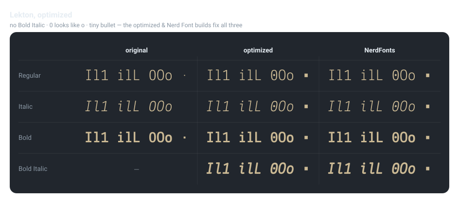
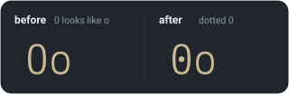

# Optimized Lekton + ligatures + Nerd Font

---

Modified [Lekton](https://fonts.google.com/specimen/Lekton) with five fixes plus [Fira Code](https://github.com/tonsky/FiraCode) programming ligatures, built for both desktop and terminal ( Nerd Font ) use.

**optimizations**



**ligatures**

[`ligaturize.sh`](./scripts/ligaturize.sh) wraps [Ligaturizer](https://github.com/ToxicFrog/Ligaturizer): it copies Fira Code's ligature glyphs and its `calt` rules into every optimized face, scale-corrected to Lekton's cell, and renames the family to `LektonLig` ( `--name`, defaulting to the `--to` dir ). `calt` never merges characters — each ligature is drawn as single-cell pieces that `calt` swaps in, so the advance width never changes and the font stays monospace.


## features

| # | FEATURE               | WHY                                                                                                                                             | EXAMPLE                                                                                                 |
| - | --------------------- | ----------------------------------------------------------------------------------------------------------------------------------------------- | ------------------------------------------------------------------------------------------------------- |
| 1 | **Bold Italic**       | Lekton ships Regular / Bold / Italic but no Bold Italic — synthesized from the Italic ( shapes ) + Bold ( weight )                              | –                                                                                                       |
| 2 | **dotted `0`**        | Lekton's `0` and `o` look nearly identical; a centered dot disambiguates them                                                                   |  |
| 3 | **bigger `•`**        | Lekton's bullet is a tiny 58-unit square ( ≈5.8% of em ); scaled up to ~200 ( 20% of em ), keeping its original square shape                    | –                                                                                                       |
| 4 | **added `^` `` ` ``** | Lekton ships without `^` ( asciicircum ) and `` ` `` ( grave ); synthesized from the face's own **â / à** accents so they match Lekton's stroke | –                                                                                                       |
| 5 | **ligatures**         | [Fira Code](https://github.com/tonsky/FiraCode) programming ligatures copied in via `calt` ( monospace-safe )                                   |                                              |

`optimized/` carries **1–4**; `LektonLig/` adds **5**; `LektonLigNF/` adds the Nerd Font glyph set on top.

## layout

| DIR                             | CONTENTS                                                                        | FEATURES |
| ------------------------------- | ------------------------------------------------------------------------------- | -------- |
| [`original/`](./original)       | vendor Lekton — Regular / Bold / Italic ( untouched )                           | —        |
| [`optimized/`](./optimized)     | 4 desktop faces — Regular / Bold / Italic / **Bold Italic**                     | 1–4      |
| [`LektonLig/`](./LektonLig)     | 4 desktop faces + Fira Code ligatures                                           | 1–5      |
| [`LektonLigNF/`](./LektonLigNF) | 4 Nerd Font Mono faces ( `otf` + `ttf` )                                        | 1–5 + NF |
| [`scripts/`](./scripts)         | `bolditalic.py` · `dotzero.py` · `glyphfix.py` · `ligaturize.sh` · `preview.py` | —        |
| [`build.sh`](./build.sh)        | one-click rebuild of all three output dirs                                      | —        |

```bash
original  ──▶  optimized  ──▶  LektonLig  ──▶  LektonLigNF
 vendor       1 bolditalic     5 ligaturize      + Nerd Font
              2 dotzero          ( Ligaturizer )   ( font-patcher )
              3 + 4 glyphfix
```

Lekton declares no OFL Reserved Font Name, so the family keeps the name **Lekton** ( `optimized/` ), the ligature build is **LektonLig**, and the Nerd Font faces install as **LektonLigNerdFontMono**.

## install

- **editor / desktop, no ligatures** → the four faces in [`optimized/`](./optimized).
- **editor / desktop, with ligatures** → the four faces in [`LektonLig/`](./LektonLig).
- **terminal / prompt with glyphs** → the four faces in [`LektonLigNF/`](./LektonLigNF)
  ( use the `ttf` unless your terminal prefers `otf` ).

> [!TIP]
> - macOS: double-click a font, or drop the files into `~/Library/Fonts`.
> - Linux: copy into `~/.local/share/fonts` then `fc-cache -f`.

> [!NOTE]
> Enable **contextual alternates** ( `calt` ) in your editor to see the ligatures — most editors and terminals keep it on by default.

## build

```bash
bash build.sh              # rebuild optimized/, LektonLig/ and LektonLigNF/ ( NF step is silent by default )
bash build.sh --all        # also refresh the README SVGs ( assets/preview.svg + zero.svg + ligatures.svg )
bash build.sh --verbose    # show the font-patcher output for the NF step
bash build.sh --dry-run    # print every command, change nothing
bash build.sh --help       # list all options
```

Requires:
- FontForge ( `brew install fontforge` ), `hb-shape` ( `brew install harfbuzz`, for `--all` )
- Nerd Font step, `font-patcher` at `/opt/FontPatcher/font-patcher`.
- `ligaturize.sh` clones [Ligaturizer](https://github.com/ToxicFrog/Ligaturizer) to `/opt/Ligaturizer`, on first run and `reset --hard`s it to the latest on later runs
- Script details and options: [CONTRIBUTING.md](./CONTRIBUTING.md).

## how the ligatures work

Ligaturizer copies Fira Code's ligature glyphs and its `calt` rules into each face, scale-corrected to Lekton's cell.<br>
`calt` never merges characters — each ligature is drawn as single-cell pieces ( `CR.n.m` + `lig.n` ) that `calt` swaps in, so the advance width never changes and the font stays monospace.

> [!NOTE]
> **Italic ligatures are upright.** Fira Code has no italic, so every face gets the same upright ligature glyphs — in italic code the letters slant but `->` / `==` stay vertical.

## license & credits

- **Lekton** © Accademia di Belle Arti di Urbino — [SIL Open Font License 1.1](./LICENSE) ( no Reserved Font Name ).
- Modifications ( Bold Italic, dotted `0`, bigger `•`, added `^` `` ` ``, ligature + Nerd Font patching ) by marslo, released under the same OFL 1.1.
- Ligatures via [Fira Code](https://github.com/tonsky/FiraCode) ( OFL 1.1 ) · [Ligaturizer](https://github.com/ToxicFrog/Ligaturizer) ( script GPL-3.0, used as an external tool — the fonts it produces are not GPL ).
- Nerd Font glyphs via [Nerd Fonts](https://github.com/ryanoasis/nerd-fonts).
